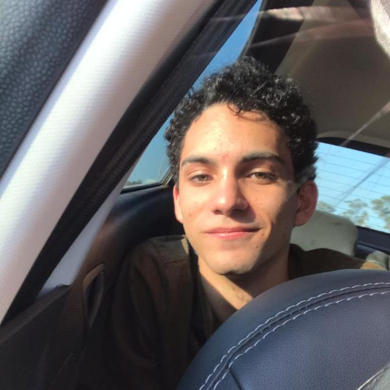
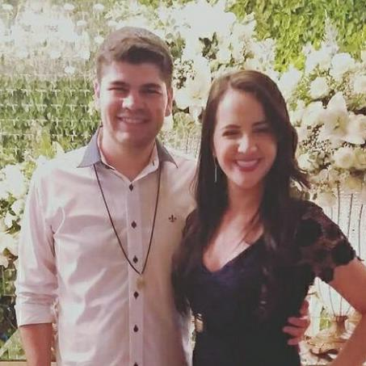

## 1. Sobre o projeto

Repositório reservado à disciplina de Requisitos de Software da Universidade de Brasília sobre a requisitos do aplicativo Disney+. Ele retém o armazenamento e a apresentação de artefatos e processos desenvolvidos na disciplina, como pré-rastreamento, heurística, modelagem, análise e pós-rastreamento para melhorar os requisitos não funcionais e funcionais do aplicativo.

## 2. Sobre a Disney+
O Disney+ é um serviço de assinatura de streaming de vídeo, fornecendo filmes e séries de televisão produzidos pelos estúdios relacionados e o próprio Walt Disney Television. Servindo junto às outras plataformas de streaming da Disney, o Disney+ centra-se no "entretenimento voltado para a família".

## 3. Equipe

|                                                   | Membro           | Github       |
|---------------------------------------------------|------------------|--------------|
|  | Juliana Valle  | julianavalle |
|     | Mateus Gomes |matgomes21    |
| | Matheus Afonso | matheusafonsouza    |
|    | Paulo Victor | twistershark |
| | Thiago Mesquita | thiagompc    |
|    | Vinícius Saturnino |  viniciussaturnino |