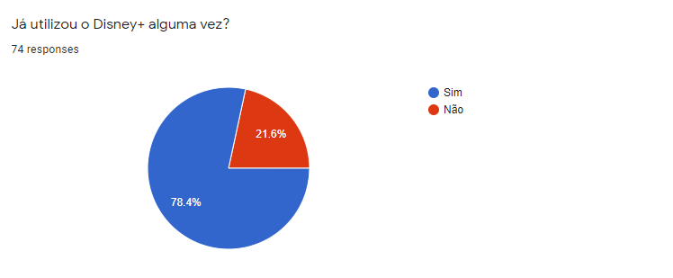
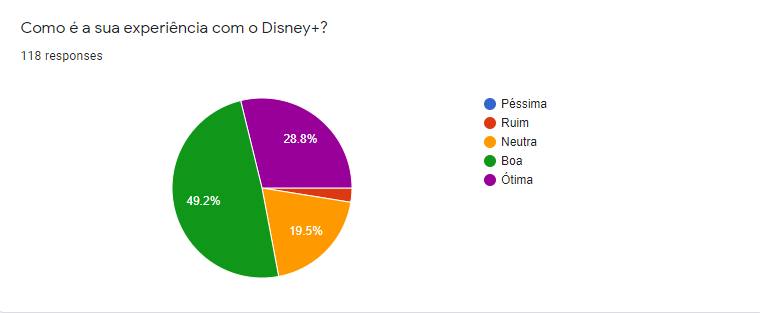

# Questionário

## 1. Definição

&emsp;&emsp;A técnica de elicitação através de questionário é baseada em realizar uma pesquisa com um conjunto de pessoas de forma a entender a opinião, visão e demais problemas relacionados a algum tema. No caso do nosso projeto, esse questionário é realizado de forma online, pois não gera custos para a equipe, evita possíveis riscos de saúde devido à pandemia e colabora para que consigamos colher um maior número de dados de pessoas em realidades diferentes.

## 2. Metodologia

&emsp;&emsp;Para conseguirmos analisar os dados com precisão e diminuirmos a quantidade de respostas incoerentes com a realidade dos usuários da Disney+, decidimos iniciar com a verificação de se o usuário é ativo na plataforma ou se já a utilizou alguma vez. Caso o usuário informe que nunca utilizou o Disney+, redirecionamos o mesmo para a finalização do questionário. Caso contrário, seguimos com as perguntas que o grupo discerniu abranger de forma mais ampla a plataforma de streaming do projeto.

&emsp;&emsp;Levando em consideração a pouca flexibilidade que essa técnica pode fornecer por ser constituída principalmente de perguntas "fechadas", que não permitem o indivíduo que está respondendo a liberdade de descrever sua resposta, por isso, a equipe decidiu adicionar a opção de resposta aberta em algumas questões específicas para tentar diminuir essa limitação em utilizar questionários para elicitar requisitos.

&emsp;&emsp;Decidimos montar o questionário utilizando a plataforma Google Forms. Após um período de preparação, finalizamos a montagem do questionário com um total de 10 perguntas, tentando abordar todos os aspectos que o grupo discerniu serem mais importantes em relação ao projeto e tomamos cuidado com o tamanho do questionário para evitar desgastes por parte de quem fosse responder.

&emsp;&emsp;Através da divulgação e do compartilhamento dos integrantes da equipe, conseguimos receber um total de 135 respostas concluindo o objetivo que tínhamos com essa técnica e tendo uma boa diversidade de respostas para a análise da equipe.

## Questões

### Questão 1

### Questão 2

### Questão 3

### Questão 4

### Questão 5

### Questão 6

### Questão 7

### Questão 8

### Questão 9

### Questão 10

## 1. Histórico de Versão

| Versão | Data       | Descrição                                           | Autor        |
| ------ | ---------- | --------------------------------------------------- | ------------ |
| 0.1    | 20/08/2021 | Criação da documentação relacionada ao questionário | Paulo Victor |
| 0.2    | 22/08/2021 | Adiciona definição, metodologia e questões          | Paulo Victor |
