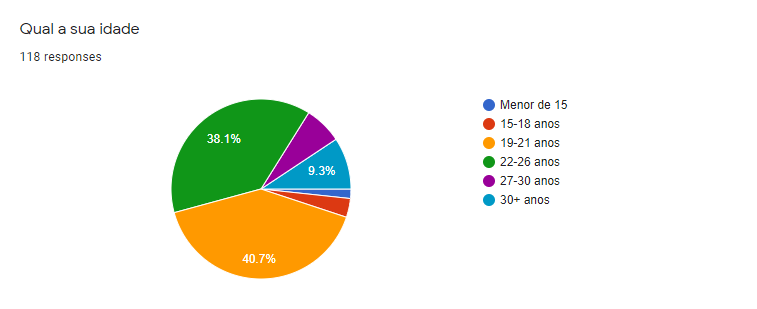
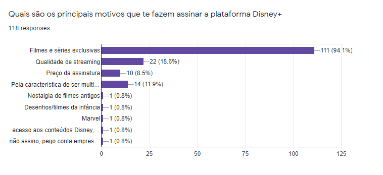
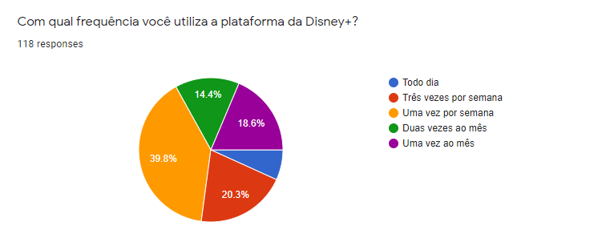
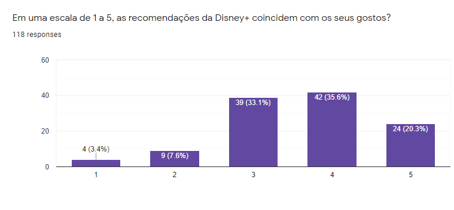
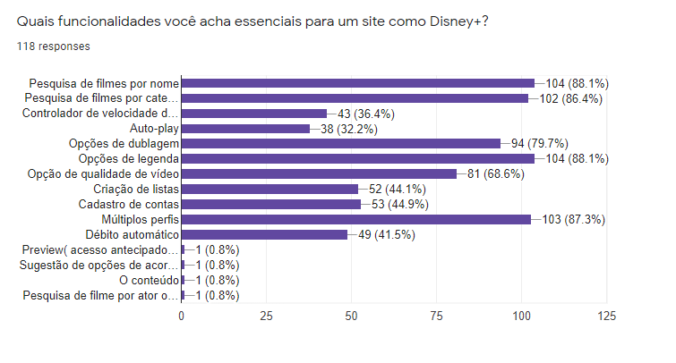
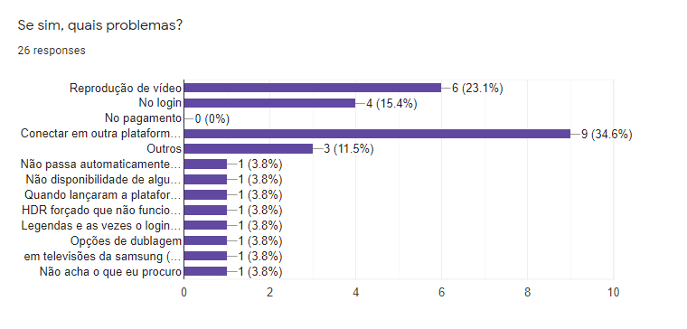
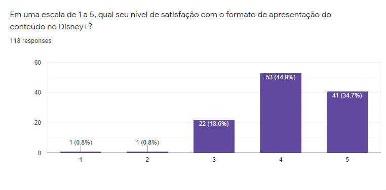

# Questionário

## 1. Definição

&emsp;&emsp;A técnica de elicitação através de questionário é baseada em realizar uma pesquisa com um conjunto de pessoas de forma a entender a opinião, visão e demais problemas relacionados a algum tema. No caso do nosso projeto, esse questionário é realizado de forma online, pois não gera custos para a equipe, evita possíveis riscos de saúde devido à pandemia e colabora para que consigamos colher um maior número de dados de pessoas em realidades diferentes.

## 2. Metodologia

&emsp;&emsp;Para conseguirmos analisar os dados com precisão e diminuirmos a quantidade de respostas incoerentes com a realidade dos usuários da Disney+, decidimos iniciar com a verificação de se o usuário é ativo na plataforma ou se já a utilizou alguma vez. Caso o usuário informe que nunca utilizou o Disney+, redirecionamos o mesmo para a finalização do questionário. Caso contrário, seguimos com as perguntas que o grupo discerniu abranger de forma mais ampla a plataforma de streaming do projeto.

&emsp;&emsp;Levando em consideração a pouca flexibilidade que essa técnica pode fornecer por ser constituída principalmente de perguntas "fechadas", que não permitem o indivíduo que está respondendo a liberdade de descrever sua resposta, por isso, a equipe decidiu adicionar a opção de resposta aberta em algumas questões específicas para tentar diminuir essa limitação em utilizar questionários para elicitar requisitos.

&emsp;&emsp;Decidimos montar o questionário utilizando a plataforma Google Forms. Após um período de preparação, finalizamos a montagem do questionário com um total de 10 perguntas, tentando abordar todos os aspectos que o grupo discerniu serem mais importantes em relação ao projeto e tomamos cuidado com o tamanho do questionário para evitar desgastes por parte de quem fosse responder.

&emsp;&emsp;Através da divulgação e do compartilhamento dos integrantes da equipe, conseguimos receber um total de 135 respostas concluindo o objetivo que tínhamos com essa técnica e tendo uma boa diversidade de respostas para a análise da equipe.

## 3. Questões

### Questão 1

<figcaption>Imagem 1: Questão 1 do questionário.</figcaption>

&emsp;&emsp;Nosso primeiro passo foi conhecer o público e conseguir filtrar quem estivesse respondendo de forma a evitar que quem não é usuário responda as questões seguintes de forma aleatória prejudicando nossa análise dos resultados.

### Questão 2

<figcaption>Imagem 2: Questão 2 do questionário.</figcaption>

&emsp;&emsp;Outro ponto importante é conhecer a idade do público da aplicação. Por isso, decidimos adicionar essa pergunta. Já é possível perceber que o público entre 19-26 anos é o que mais utiliza a plataforma.

### Questão 3

<figcaption>Imagem 3: Questão 3 do questionário.</figcaption>

&emsp;&emsp;O objetivo dessa pergunta foi conseguirmos mapear os requisitos baseados no que motiva os usuários a assinarem a plataforma. Com isso, conseguimos priorizar requisitos no futuro baseado naquilo que o público da pesquisa definiu ser mais importante.

### Questão 4

<figcaption>Imagem 4: Questão 4 do questionário.</figcaption>

&emsp;&emsp;Através dessa pergunta será possível modelarmos o projeto de forma a se encaixar melhor no formato de utilização dos assinantes.

### Questão 5

<figcaption>Imagem 5: Questão 5 do questionário.</figcaption>

&emsp;&emsp;Para conseguirmos modelar a plataforma de forma a agradar os assinantes, decidimos adicionar essa pergunta de forma a conseguirmos ter uma visão completa da experiência do assinante na plataforma, sendo 1 quase não coincidem e 5 coincidem muito.

### Questão 6

<figcaption>Imagem 6: Questão 6 do questionário.</figcaption>

&emsp;&emsp;Nessa questão conseguimos uma visão mais detalhada dos requisitos necessários e através da porcentagem de escolha dos usuários, é possível priorizarmos o que trará mais valor.

### Questão 7

<figcaption>Imagem 7: Questão 7 do questionário.</figcaption>

&emsp;&emsp;A vantagem dessa pergunta é que conseguimos entender se o produto final existente está conseguimos corresponder as expectativas dos usuários ou não.

### Questão 8

<figcaption>Imagem 8: Questão 8 do questionário.</figcaption>

&emsp;&emsp;Essa questão é muito importante que nos permite analisar a experiência do usuário e se existe um grande número de assinantes que estão ou não tendo uma boa experiência.

### Questão 9

<figcaption>Imagem 9: Questão 9 do questionário.</figcaption>

&emsp;&emsp;Através dessa pergunta conseguimos mapear aquilo que não existe atualmente na plataforma e que seria importante adicionarmos na lista de requisitos. Apenas conhecendo as dores dos assinantes é que conseguiremos focar no que irá gerar mais valor para os assinantes.

### Questão 10

<figcaption>Imagem 10: Questão 10 do questionário.</figcaption>

&emsp;&emsp;Por fim, decidimos analisar a satisfação do usuário com relação a UI e UX da plataforma, sendo 1 pouco satisfeito e 5 muito satisfeito.

## 4. Histórico de versão

| Versão | Data       | Descrição                                           | Autor        |
| ------ | ---------- | --------------------------------------------------- | ------------ |
| 0.1    | 20/08/2021 | Criação da documentação relacionada ao questionário | Paulo Victor |
| 0.2    | 22/08/2021 | Adiciona definição, metodologia e questões          | Paulo Victor |
| 0.3    | 24/08/2021 | Adição de legendas e correções na formatação        | Mateus Gomes |
| 0.4    | 02/09/2021 | Adição de descrição sobre cada pergunta             | Paulo Victor |
