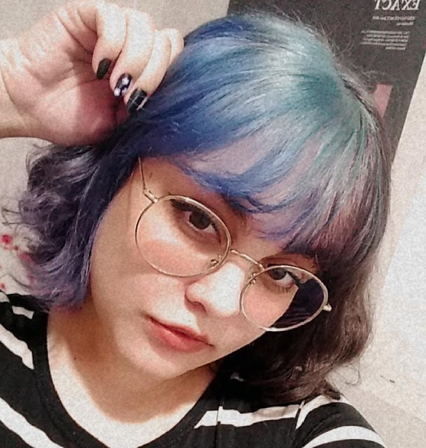
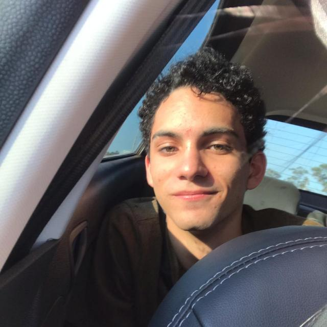

## 1. Sobre o projeto

&emsp;&emsp;Repositório reservado à disciplina de Requisitos de Software da Universidade de Brasília sobre a requisitos do aplicativo Disney+. Ele retém o armazenamento e a apresentação de artefatos e processos desenvolvidos na disciplina, como pré-rastreamento, heurística, modelagem, análise e pós-rastreamento para melhorar os requisitos não funcionais e funcionais do aplicativo.

## 2. Sobre a Disney+

&emsp;&emsp;O Disney+ é um serviço de assinatura de streaming de vídeo, fornecendo filmes e séries de televisão produzidos pelos estúdios relacionados e o próprio Walt Disney Television. Servindo junto às outras plataformas de streaming da Disney, o Disney+ centra-se no "entretenimento voltado para a família".

## 3. Equipe

|                                                      | Membro             | Github            |
| :----------------------------------------------------: | :------------------: | :-----------------: |
|         | Juliana Valle      | [julianavalle](https://github.com/julianavalle)      |
|     | Mateus Gomes       | [matgomes21](https://github.com/matgomes21)        |
|  | Matheus Afonso     | [matheusafonsouza](https://github.com/matheusafonsouza)  |
|            | Paulo Victor       | [twistershark](https://github.com/twistershark)      |
|          | Thiago Mesquita    | [thiagompc](https://github.com/thiagompc)         |
|        | Vinícius Saturnino | [viniciussaturnino](https://github.com/viniciussaturnino) |

## 4. Histórico de versão

| Versão | Data       | Descrição                                           | Autor        |
| ------ | ---------- | --------------------------------------------------- | ------------ |
| 0.1    | 20/08/2021 | Criação da página de início | Paulo Victor e Juliana Valle |
| 0.2    | 24/08/2021 | Correções de formatação | Mateus Gomes |