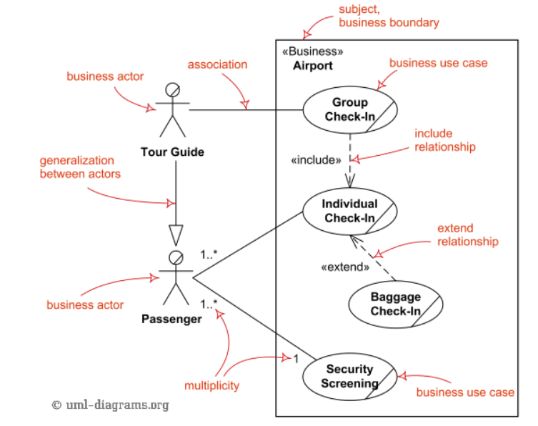
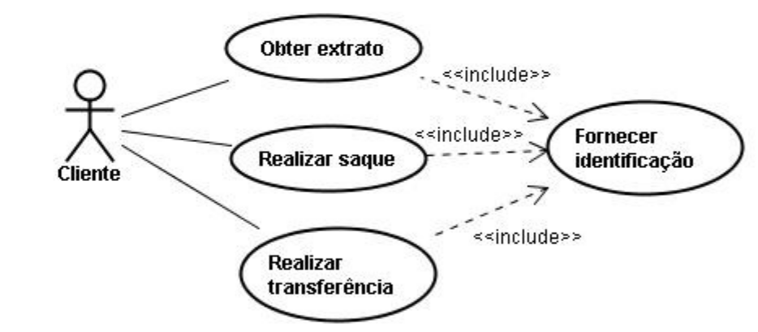
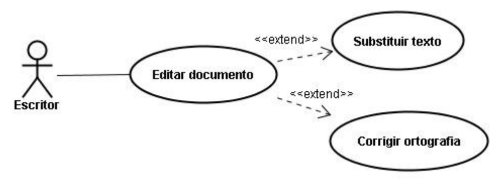
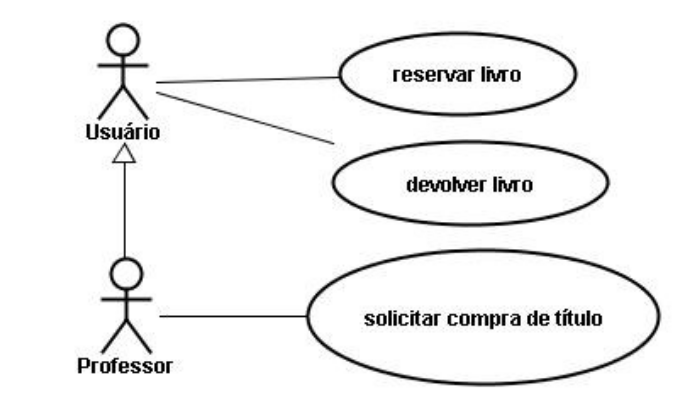
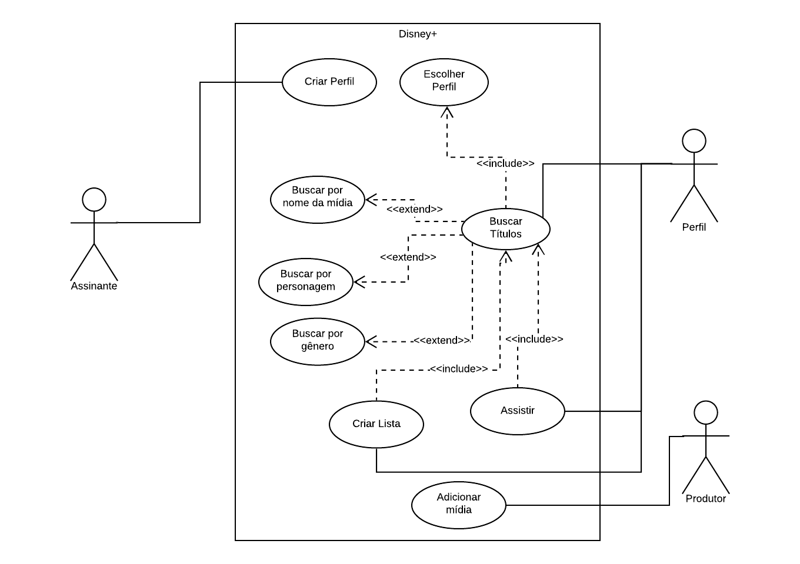

# Casos de Uso

## 1. Introdução

&emsp;&emsp;Os casos de usos, também chamados de diagramas comportamentais na notação UML, são usados para descrever um conjunto de ações que um sistema ou um conjunto de sistemas deve desempenhar em colaboração com um ou mais usuários externos ao sistema. Os casos de uso devem prover um resultado observável e de valor para os atores ou outros interessados do sistema.

## 2. Diagrama de Casos de Uso

&emsp;&emsp;Na notação UML, o diagrama de casos de uso é o principal diagrama para modelar requisitos, com foco em requisitos funcionais.

<figcaption>Imagem 1: Elementos do Diagrama de Casos de Uso.</figcaption>

### 2.1 Casos de uso

&emsp;&emsp;Representam a funcionalidade fornecida pelo sistema, modelando um diálogo entre um ator e o sistema. O conjunto de casos de uso para um sistema constitui todos os caminhos definidos nos quais o sistema pode ser usado. São representados por elipses e devem ser escritos como verbos no infinitivo, para indicar que são ações.

### 2.2 Atores
&emsp;&emsp;Representam algo ou alguém que deve interagir com o sistema, não fazendo parte do mesmo. Um ator é representado pela figura do boneco palito.

### 2.3 Limite do sistema

&emsp;&emsp;Delimita os limites do sistema e é representado por um retângulo.

### 2.4 Relacionamentos

&emsp;&emsp;São utilizados para representar as interações entre os atores e os casos de uso.

#### 2.4.1 Associação

&emsp;&emsp;Podem existir entre um ator e um caso de uso, representando uma comunicação entre os mesmos. É representado por uma linha que liga os elementos relacionados.

#### 2.4.2 Relacionamentos include

&emsp;&emsp;São criados entre um novo caso de uso e qualquer outro caso de uso que utilize esta funcionalidade. São representados pela seta pontilhada ligando os elementos relacionados.

<figcaption>Imagem 2: Relacionamento include.</figcaption>

#### 2.4.3 Relacionamentos extend

&emsp;&emsp;São usados para mostrar um comportamento opcional, que somente é executado sobre determinadas condições. São representados pela seta pontilhada ligando os elementos relacionados.

<figcaption>Imagem 3: Relacionamento extend.</figcaption>

#### 2.4.4 Generalizações
&emsp;&emsp;Representam uma especialização entre casos de uso ou entre atores. São representados por uma seta de generalização.

<figcaption>Imagem 4: Generalização.</figcaption>

## 3. Diagramas

### 3.1 Fluxo de conta

## 4. Bibliografia

> - SERRANO, Maurício; SERRANO, Milene; Requisitos - Aula 13;
> - UML Use Case Diagrams. UML Diagrams. Disponível em: <https://www.uml-diagrams.org/use-case-diagrams.html> 
> - PIMENTEL, Andrey Ricardo. Projeto de Software Usando a UML. 2007.

## 5. Histórico de versão

| Versão | Data       | Descrição                                           | Autor        |
| ------ | ---------- | --------------------------------------------------- | ------------ |
| 0.1    | 29/08/2021 | Criação do documento | Mateus Gomes |
| 0.2    | 29/08/2021 | Criação do diagrama de fluxo de conta | Todos os integrantes |
| 0.3    | 02/09/2021 | Criação da introdução, diagrama de casos de uso e bibliografia | Mateus Gomes |
