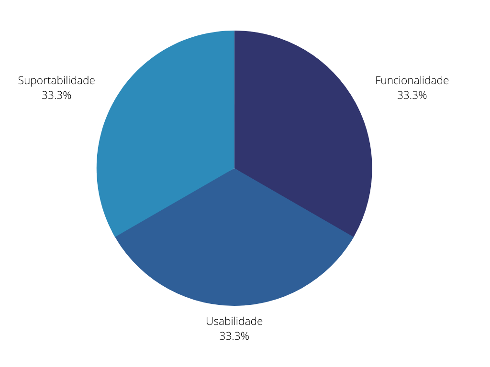

# Especificação Suplementar

## 1. Introdução
&emsp;&emsp;Especificação Suplementar é um documento em linguagem natural, no qual são descritos requisitos não funcionais. As Especificações Suplementares são um importante complemento para o Modelo de Caso de Uso, porque, juntas, capturam todos os requisitos de software (funcionais e não funcionais) que precisam ser descritos para servir como uma Especificação de Requisitos de Software completa.

&emsp;&emsp;A Especificação Suplementar captura os requisitos do sistema que não são prontamente capturados nos casos de uso do modelo de caso de uso. Entre os requisitos estão incluídos:

- Requisitos legais e de regulamentação e padrões de aplicativo
- Atributos de qualidade do sistema a ser criado, incluindo requisitos de  usabilidade, confiabilidade, desempenho e suportabilidade
- Outros requisitos, como aqueles para os sistemas e ambientes operacionais, compatibilidade com outro software e restrições de design

## 2. Metodologia
&emsp;&emsp;Para a categorização dos requisitos não funcionais neste projeto, foi utilizado o modelo FURPS+. Utilizando o acrônimo FURPS para descrever as principais categorias de requisitos com subcategorias, conforme mostrado a seguir:
- F - Funcionality (Funcionalidade)
    - Os requisitos funcionais podem incluir:
        - Conjuntos de recursos
        - Recursos
        - Segurança
 
- U - Usability (Usabilidade)
    - Os requisitos de utilidade podem incluir: 
        - Fatores humanos
        - Estética
        - Consistência na interface com o usuário
        - Ajuda on-line e sensível ao contexto
        - Assistentes e agentes
        - Documentação do usuário
        - Materiais de treinamento
 
- R - Reliability (Confiabilidade)
    - Os requisitos de confiabilidade podem incluir:
        - Freqüência e gravidade de falha
        - Possibilidade de recuperação
        - Possibilidade de previsão
        - Precisão
        - Tempo médio entre falhas (MTBF)
 
- P - Performance (Performance)
    - Um requisito de performance ,ou, desempenho, pode incluir:
        - Velocidade
        - Eficiência
        - Disponibilidade
        - Produtividade
        - Tempo de resposta
        - Tempo de recuperação
        - Uso de recurso
 
- S - Suportability (Suportabilidade)
    - Os requisitos de suportabilidade podem incluir:
    - Possibilidade de teste
    - Extensibilidade
    - Possibilidade de adaptação
    - Possibilidade de manutenção
    - Compatibilidade
    - Possibilidade de configuração
    - Possibilidade de serviço
    - Possibilidade de instalação
    - Possibilidade de localização (internacionalização)

 

&emsp;&emsp;O "+" em FURPS+ é para lembrá-lo de incluir requisitos como:
- Requisitos de Design
    - Frequentemente chamado de restrição de design, especifica ou restringe o design de um sistema. 
- Requisitos de implementação
    - Um requisito de implementação especifica ou restringe o código ou a construção de um sistema.
- Requisitos de interface
    - Um requisito de interface especifica: 
        - Um item externo com o qual o sistema deve interagir 
        - Restrições de formatos, tempos ou outros fatores utilizados por tal interação 
- Requisitos físicos
    - Esse tipo de requisito pode ser utilizado para representar requisitos de hardware, como as configurações físicas de rede obrigatórias.

## 3. Resultado
&emsp;&emsp;Como resultado da categarização dos requisitos não funcionais levantados na etapa de elicitação de requisitos:

| Sigla | Categoria | Requisitos                                      |
|:------: | :------: | :--------------------------------------------------: |
| F | Funcionalidade   | RNF2, RNF5 |
| U | Usabilidade | RNF3, RNF4 |
| R | Confiabilidade | - |
| P | Performance | - |
| S | Suportabilidade | RNF1, RNF6 |
| + | Outros | - |

<figcaption>Tabela 1: Categorização dos requisitos não funcionais pelo modelo FURPS+</figcaption>

 

## 4. Gráfico da categorização dos requisitos não funcionais pelo modelo FURPS+

<figcaption>Gráfico 1: Categorização dos requisitos não funcionais pelo modelo FURPS+</figcaption>

## 4. Bibliografia

> - SERRANO, Maurício; SERRANO, Milene; Requisitos - Aula 13;
> - https://www.cin.ufpe.br/~gta/rup-vc/core.base_rup/workproducts/rup_supplementary_specification_F5ACAA22.html
> - https://www.cin.ufpe.br/~gta/rup-vc/core.base_rup/guidances/concepts/requirements_62E28784.html

## 5. Histórico de versão

| Versão | Data       | Descrição                      | Autor        |
| ------ | ---------- | ------------------------------ | ------------ |
| 0.1    | 01/09/2021 | Criação do documento | Thiago Mesquita |
| 0.2    | 02/09/2021 | Correções na formatação | Mateus Gomes |