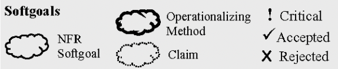
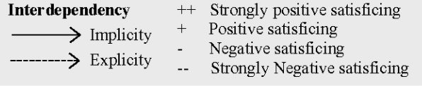

# NFR Framework

## 1. Introdução
O NFR Framework é um método de expressar e analisar Requisitos Não-Funcionais que foi proposto por Chung na Universidade de Toronto, sendo esse método uma representação sistemática e global de NFRs, abordando de uma maneira qualitativa e orientada a processos. Seu objetivo é ajudar os desenvolvedores a implementar soluções customizadas, levando em consideração as características dos campos e sistemas relacionados. Essas características incluem requisitos não funcionais, requisitos funcionais, prioridades e cargas de trabalho. Essas condições determinam a escolha de alternativas de desenvolvimento para um determinado sistema.

Além disso, essa implementação representa o NFR como um softgoal, os quais são unidades básicas para representar requisitos não-funcionais. Ele possui uma relação de interdependência entre seus softgoals, oferece técnicas de operacionalização e fornece catálogos para inferir possíveis interações.

## 2. Metodologia
&emsp;&emsp;Através desse documento, buscamos definir as funcionalidades dos requisitos não-funcionais através da implementação de diagramas utilizando o NFR Framework, criando análises das possíveis situações.

### 3. Requisitos não funcionais
&emsp;&emsp;Abaixo estão os requisitos não-funcionais levantados através das técnicas de elicitação utilizadas no projeto, sendo os mesmo utilizados para elaboração do NFR Framework.

| Número | Requisito | Técnica        |
| :------: | ---------- | :---------------------------------------------------: |
| RNF1 | O sistema deve ser responsivo | Brainstorm |
| RNF2 | O sistema deve ter autoplay | Brainstorm, instrospeção e questionário |
| RNF3 | O sistema deve recomendar títulos semelhantes | Brainstorm |
| RNF4 | O sistema deve recomendar títulos para o perfil | Brainstorm |
| RNF5 | O usuário deve poder assistir ao mesmo tempo que outra pessoa | Brainstorm |
| RNF6 | O usuário deve poder assisir em qualquer dispositivo | Observação |

<figcaption>Tabela 1: Requisitos não funcionais.</figcaption>

### 4. Legenda

<figcaption>Imagem 1: Legenda dos elementos de definição do NFR Framework</figcaption>

<figcaption>Imagem 2: Legenda dos elementos de relacionamento do NFR Framework</figcaption>

## 5. Bibliografia

> - SILVA, Reinaldo Antônio da. NFR4ES:Um Catálogo de Requisitos Não-Funcionais para Sistemas Embarcados. Recife, 201

## 6. Histórico de versão

| Versão | Data       | Descrição                      | Autor          |
| ------ | ---------- | ------------------------------ | -------------  |
| 0.1    | 11/09/2021 | Criação do documento           | Matheus Afonso |
| 0.2    | 11/09/2021 | Legendas do NFR Framework      | Matheus Afonso |
| 0.3    | 11/09/2021 | Atualizando a introdução e bibliografia | Juliana |