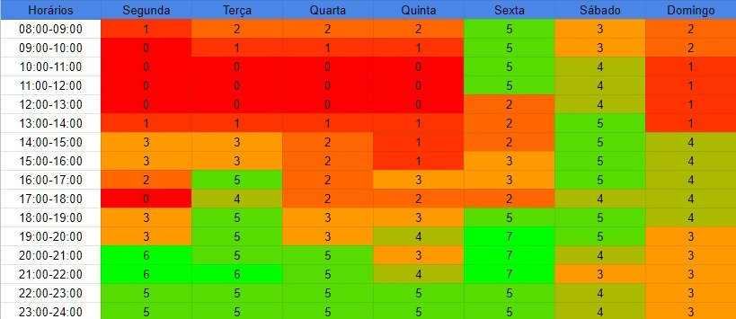

# Cronograma

## 1. Introdução

&emsp;&emsp;Analisando o cronograma do semestre letivo, os prazos da disciplina e a disponibilidade dos integrantes, foi criado um cronograma dividido em etapas para a realização das atividades e criação dos artefatos.

## 2. Cronograma de atividade

| Etapas | Título       | Data                                           | Descrição        | Apresentação        |
| :------: | :----------: | :---------------------------------------------------: | :------------: | :------------: |
| I    | Planejamento | 04/08 ~ 20/08 | Planejamento do projeto e RichPicture | 05/08 |
| II    | Elicitação | 21/08 ~ 29/08 | Técnicas e Priorização | 24/08 |
| III    | Modelagem de Requisitos | 30/08 ~ 10/09 | Cenários, Léxico, Casos de Uso e Especificação Suplementar | 02/09 |
| IV    | Modelagem de Requisitos - Ágil | 11/09 ~ 17/09 | Histórias de Usuário, Backlog e NFR Framework | 21/09 |
| V    | Análise de Requisitos | 18/09 ~ 08/10 | Verificação & Validação | 23/09 |
| VI    | Pós-Rastreabilidade | 09/10 ~ 19/10 | Gerência de Desenvolvimento de Software orientada à baseline de Requisitos | 14/10 |
| VII    | Apresentação final | 20/10 ~ 26/10 | Conclusão do projeto | 21/10 ~ 26/10 |

<figcaption>Tabela 1: Cronograma de atividades.</figcaption>

## 3. Mapa de calor

&emsp;&emsp;Para organizar as reuniões do grupo, foi criado um mapa de calor analisando os horários livres dos integrantes. Cada integrante adicionou numa planilha seus horários ocupados e livres, e a partir dessas informações, uma planilha foi gerada com os horários mais livres e mais ocupados.

<figcaption>Imagem 1: Mapa de calor do grupo.</figcaption>

## 4. Histórico de versão

| Versão | Data       | Descrição                                           | Autor        |
| ------ | ---------- | --------------------------------------------------- | ------------ |
| 0.1    | 23/08/2021 | Criação da introdução | Mateus Gomes |
| 0.2    | 24/08/2021 | Adição do cronograma de atividades | Mateus Gomes e Juliana |
| 0.3    | 24/08/2021 | Adição do mapa de calor e formatação | Mateus Gomes e Juliana |
| 0.4    | 24/08/2021 | Correções de formatação | Mateus Gomes |